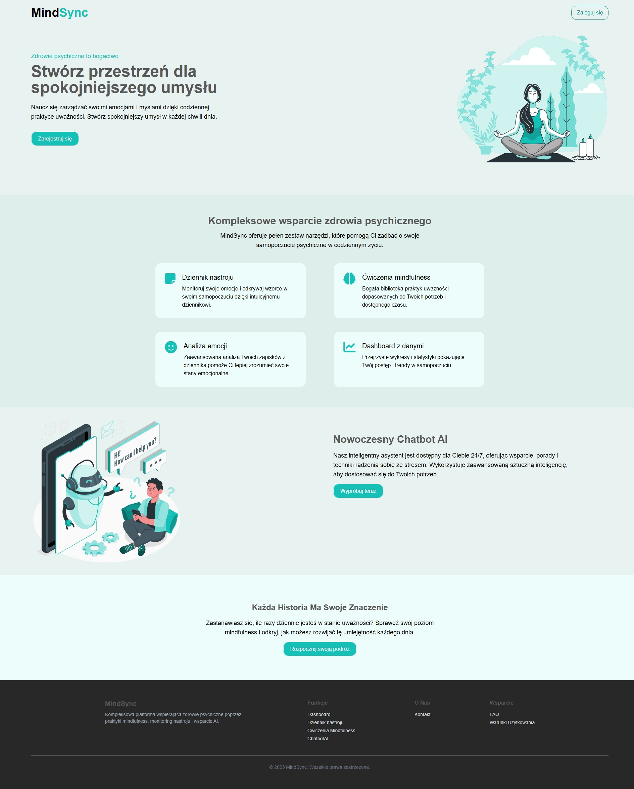
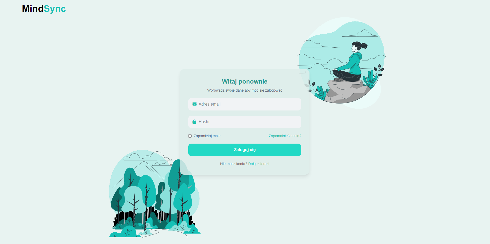
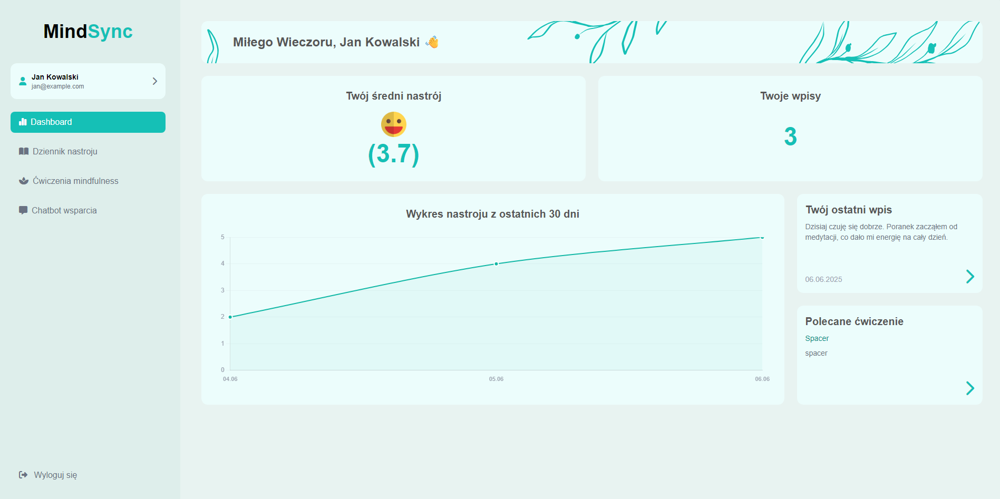
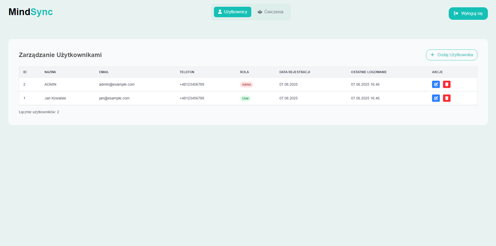

# MindSync
Zespół projektowy: Agata Stramska, Mateusz Rosiński , Jakub Selonke
## Cel Projektu
Stworzenie aplikacji webowej "MindSync", która będzie służyć jako kompleksowa
platforma wspierająca użytkowników w dbaniu o zdrowie psychiczne. Aplikacja będzie
dostarczać narzędzia do monitorowania nastroju, praktykowania mindfulness,
uzyskiwania wsparcia poprzez chatbota oraz analizy własnych emocji w czasie.

## Wykorzystane technologie

|Kategoria   |Technologie         | 
|---|---|
| Frontend |  HTML, CSS, Tailwind, JavaScript  | 
| Backend | PHP, Laravel   | 
| Databases | PostgreSQL |    
| Devops/Other | GitHub, Figma, Vite |    

## Uruchomienie aplikacji
Będąc w /MindSync/mindsync/:  

**Instalacja pakietów**:  
`npm install`  
`composer install`

**Uruchomienie projektu**:  
`composer run dev`  

## Zdjęcia gotowej aplikacji
  
  
  
  
